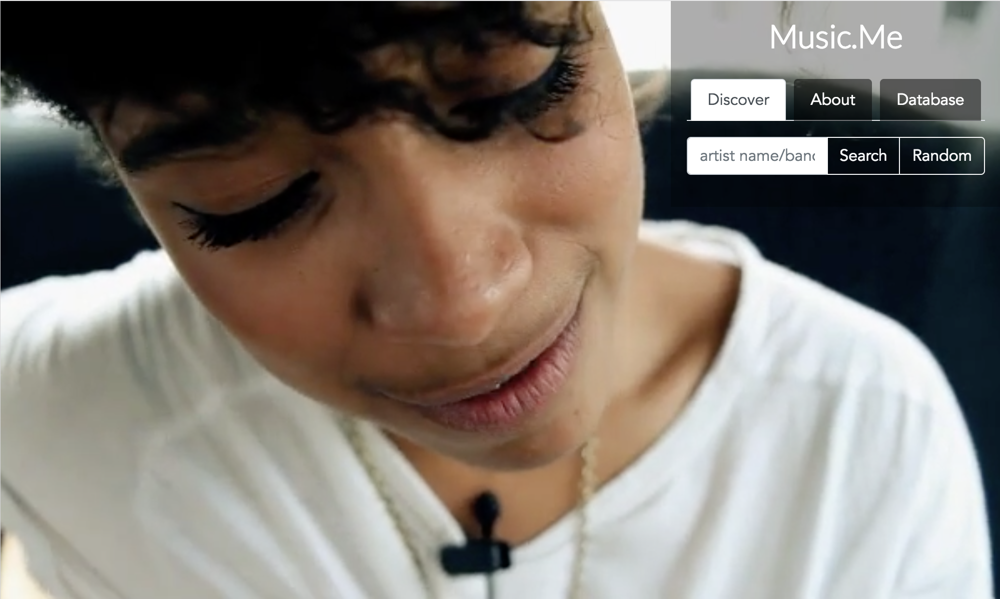

# Music.Me

## Live Link 
- https://dcdi22.github.io/Project1/

## Description

Music.Me is a music resource application that focuses on representation in the music industry, specifically providing a resource for those seeking out under-represented groups in media. We want Music.Me to help individuals find Musicians in which they see themselves.

Our app allows users to search for musicians and find a sampling of their tracks AS WELL AS showcasing a directory focused on artists from marginalized groups pertaining to one or more of the following categories: 
Persons of color 
LGBT persons 
& Women
 
 To help in the discovery process we've also included the 'random button' that will pull in an artist from the database and display information about them as well as begin playing a sampling of their music.

## Requirements
- Must uses at least two APIs
- Must use AJAX to pull data
- Must utilize at least one new library or technology that we haven’t discussed
- Must have a polished frontend / UI
- Must meet good quality coding standards (indentation, scoping, naming)
- Must NOT use alerts, confirms, or prompts (look into modals!)
- Must have some sort of repeating element (table, columns, etc)
- Must use Bootstrap or Alternative CSS Framework
- Must be Deployed (Heroku or Firebase)
- Must have User Input Validation
- Utilize Firebase for Persistent Data Storage (Consider this basically a requirement).
- Mobile Responsive

## Technologies Used
- jQuery for DOM manipulation
- AJAX for API GET requests
- Bootstrap
- HTML/CSS
- Firebase
- Vimeo API
- Spotify API
- LastFm API

